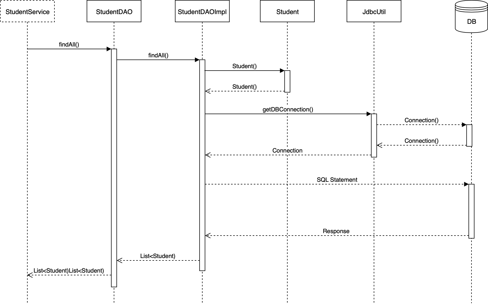

# Ejemplo DAO (Data Access Object)
El siguiente ejemplo de uso del DAO con una base de datos.

## Dependencias

- Java
- Gradle
  - java -> Plug-in de java
  - DB Connector -> mysql-connector-java
  - Log4J -> org.apache.logging.log4j

## Base de datos

La base de datos que vamos a utilizar es MySQL, para ello es recomendable instalar un paquete de soluciones. Opciones:

- XAMPP: https://www.apachefriends.org/index.html
  - MySQL
  - PHPMyAdmin
- MySQL (MariaDB): https://mariadb.org/

